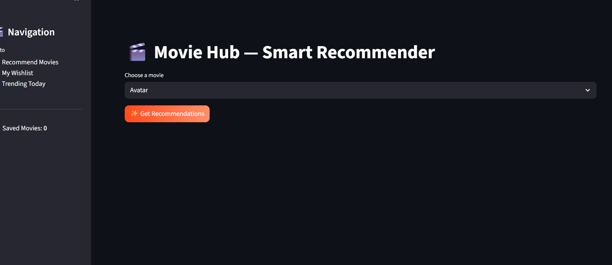
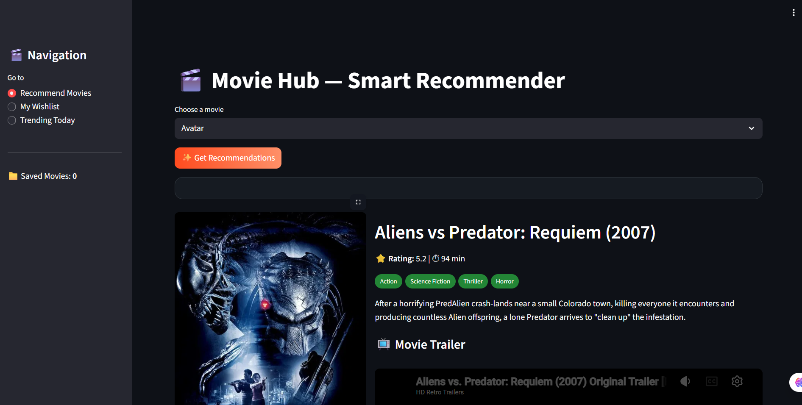
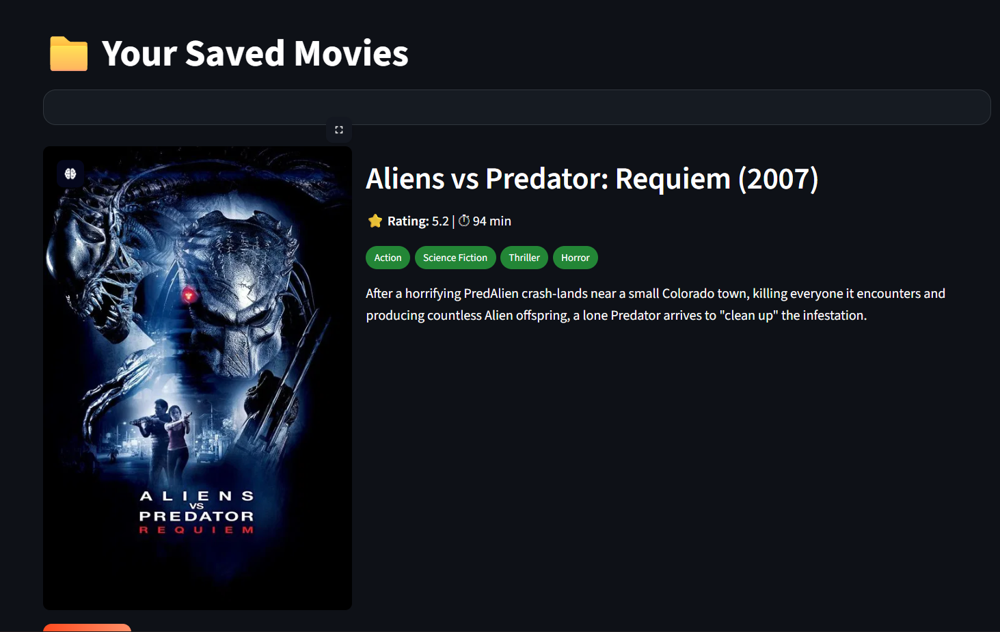
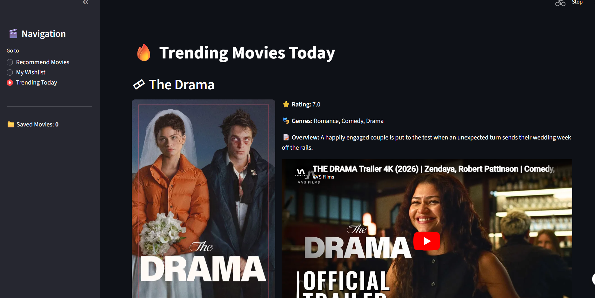

# 🎬 Movie Hub — Smart Recommender & Trending Dashboard

<p align="center">
  
</p>

<p align="center">
  
  
  
  
  
</p>

---

## 📌 Overview
**Movie Hub** is an intelligent movie recommendation system that suggests movies based on user preferences using **content-based filtering**. It also integrates real-time trending data using the TMDB API.

---

## 🎥 Demo

<p align="center">
  
</p>

---

## 🖼️ Screenshots

| Home Page | Recommendations |
|----------|---------------|
|  |  |

| Saved Movie | Trending |
|--------------|----------|
|  |  |

---

## 🚀 Features

- 🎯 **Smart Recommendations** using cosine similarity  
- 🔥 **Trending Movies (Live API)**  
- 🎬 **Posters, Ratings & Trailers**  
- 👥 **Cast Details Integration**  
- ❤️ **Watchlist Feature**  
- 🌙 **Modern Dark UI (Streamlit)**  

---

## 🧠 How It Works

- Text vectorization of movie metadata  
- Cosine similarity to find closest matches  
- Precomputed similarity matrix for fast results  
- TMDB API for real-time data  

---

## 🛠️ Tech Stack

| Category        | Tools Used |
|----------------|----------|
| Frontend       | Streamlit |
| Backend        | Python |
| ML Algorithm   | Cosine Similarity |
| Data Handling  | Pandas |
| API            | TMDB |
| Storage        | Pickle |

---

## 📂 Project Structure


---

## ⚙️ Installation

### 1️⃣ Clone the repository
```bash
git clone https://github.com/YOUR_USERNAME/movie-recommender.git
cd movie-recommender


2️⃣ Install dependencies
pip install -r requirements.txt


3️⃣ Add TMDB API Key
Get API key from: https://www.themoviedb.org/
Add it in app.py or .streamlit/secrets.toml


4️⃣ Run the app
streamlit run app.py


🌍 Deployment
You can deploy easily on:

Streamlit Cloud

Render

Railway

🧪 Future Improvements
🔍 Search Autocomplete

🤖 Hybrid Recommendation System

📱 Mobile UI Optimization

👤 User Authentication

🤝 Contributing
Pull requests are welcome. For major changes, open an issue first.

📬 Contact
GitHub: https://github.com/YOUR_USERNAME

Email: your-email@example.com

⭐ Show Your Support
If you like this project, give it a ⭐ on GitHub!

